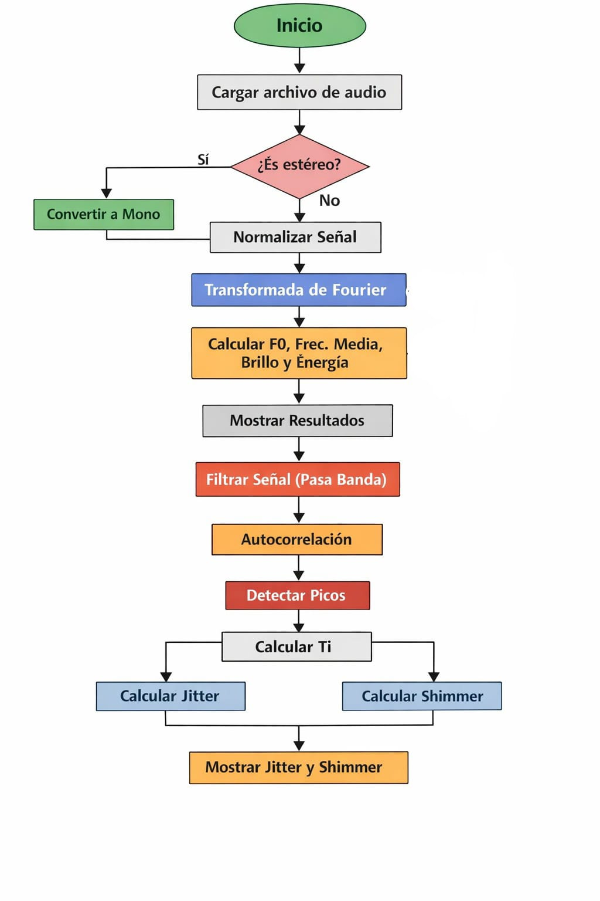
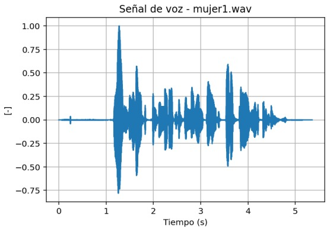
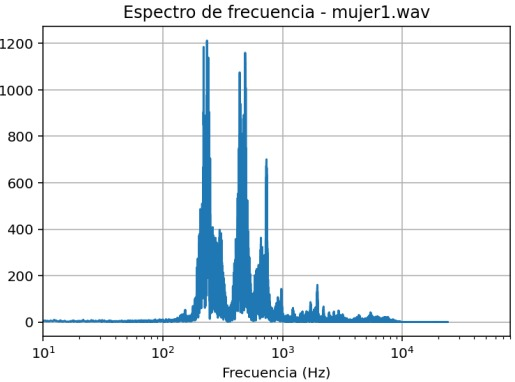
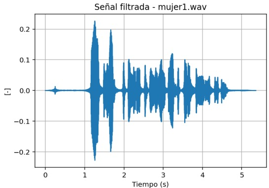
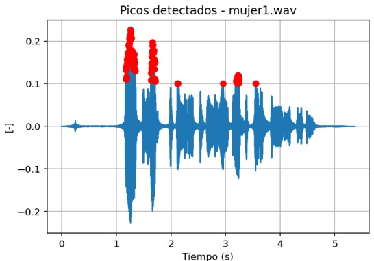

# Análisis espectral de la voz
## Segundo Laboratorio, procesamiento digital de señales

**Maria Camila Ospina Jara, Juan Felipe Serna Alarcón**

## Descripción
<div align="justify">
  Esta actividad de laboratorio se centró en el empleo de técnicas de análisis espectral para la diferenciación y clasificación de señales de voz según el género (masculino y femenino)
Utilizando herramientas de procesamiento digital en Python, se extrajeron atributos del dominio de la frecuencia para reconocer la importancia de parámetros como el brillo, la intensidad 
y la estabilidad vocal en contextos de ingeniería biomédica

## Introducción
Las características espectrales son fundamentales para el análisis y la comprensión de las señales de voz, ya que permiten capturar los patrones fonéticos, los rasgos del hablante y los matices lingüísticos. 
Durante esta práctica, se exploraron conceptos clave como el centroide espectral (centro de masa del espectro), la frecuencia fundamental (F0) que define la altura tonal, y la frecuencia media. Asimismo, se
abordaron medidas de inestabilidad vocal como el jitter (variación de frecuencia) y el shimmer (variación de amplitud), los cuales son indicadores de la calidad de la vibración de las cuerdas vocales y tienen una
alta relevancia en la detección de patologías y el reconocimiento de voz.

## Desarrollo de la práctica 
### Parte A: Adquisición y Caracterización Básica
En esta fase inicial, se realizó la grabación de una frase corta de aproximadamente 5 segundos en 6 sujetos distintos (3 hombres y 3 mujeres) utilizando dispositivos estandarizados y guardando
los archivos en formato .wav. Posteriormente, las señales se importaron a Python para su visualización en el dominio del tiempo, lo que permitió identificar la forma de onda y la presencia de
silencios o artefactos. Mediante la aplicación de la Transformada de Fourier, se obtuvieron los espectros de magnitud para identificar visual y numéricamente los picos de frecuencia, reportando para cada señal 
su frecuencia fundamental, frecuencia media, brillo e intensidad.



#### Resultados obtenidos

|Archivo     | F0 (Hz) | Frec media (Hz) | Brillo (Hz) | Energia (J)|
|------------|---------|-----------------|-------------|--------|
|hombre1.wav | 192.06  | 475.73          | 475.73      | 1965.56|
|hombre2.wav | 124.93  | 400.57          | 400.57      | 5776.35|
|hombre3.wav | 126.31  | 370.71          | 370.71      | 6723.02|
|mujer1.wav  | 69.49   | 454.73          | 454.73      | 4512.75|
|mujer2.wav  | 180.05  | 544.49          | 544.49      | 2111.32|
|mujer3.wav  | 180.08  | 475.11          | 475.11      | 3594.31|

   

```python
# Frecuencia fundamental
    
    # Buscar picos en el espectro
    peaks, _ = find_peaks(mag_pos, height=np.max(mag_pos)*0.1)
    
    if len(peaks) > 0:
        f0 = frec_pos[peaks[0]]
    else:
        f0 = 0

    mask = (frec_pos >= 50) & (frec_pos <= 4000)
    frec_pos = frec_pos[mask]
    mag_pos = mag_pos[mask]
    
    # Frecuencia media    
    frecuencia_media = np.sum(frec_pos * (mag_pos*2)) / np.sum(mag_pos*2)

    # Brillo (centroide espectral)
    brillo = frecuencia_media

    # Energia de la señal
    energia = np.sum(señal**2)
```

### Parte B: Medición de Estabilidad Vocal (Jitter y Shimmer)
Para profundizar en el análisis, se seleccionaron grabaciones representativas de cada género y se aplicó un filtro pasa-banda específico (80–400 Hz para hombres y 150–500 Hz para mujeres) 
con el fin de eliminar ruidos no deseados. Se procedió a detectar los periodos de vibración y los picos de amplitud en cada ciclo para calcular el jitter relativo y el shimmer relativo. 
Los resultados se compararon con los rangos típicos para voces sanas (≤1% para jitter y ≤3–5% para shimmer), permitiendo evaluar la estabilidad de la voz de los participantes

### Parte C: Análisis comparativo y conclusiones
- Se evidencia que los hombres presentan una frecuencia fundamental entre 97,38 Hz y 126,31 Hz, mientras que las mujeres se encuentran en un rango cercano a los 180 Hz. Esto concuerda con la literatura, que indica que las voces masculinas suelen tener una frecuencia más baja debido a la fisiología de las cuerdas vocales, las cuales son más largas que las femeninas, lo que reduce la frecuencia de vibración y genera sonidos más graves. Además, los órganos de fonación, resonancia y articulación son, en promedio, de mayor tamaño en los hombres, actuando como una caja de resonancia más amplia que favorece la amplificación de las frecuencias bajas.
  
- El hecho de que la frecuencia media y el brillo sean iguales está relacionado con la definición de ambas magnitudes, ya que el brillo, o centroide espectral, representa el “centro de masa” del espectro, indicando la frecuencia promedio de la señal.

- Las mujeres presentan un brillo mayor en comparación con los hombres. Un centroide espectral más alto se traduce en un timbre percibido como más agudo, lo cual es un rasgo característico de la voz femenina.

- El jitter y el shimmer son medidas de inestabilidad en las señales periódicas de la voz, funcionan como indicadoes objetivos de la calidad de la vibración de las cuerdas vocales. El jitter es la variación de la frecuencia ciclo a ciclo, un jitter elevado se asocia con una falta de control en la vibración de las cuerdas vocales, y el shimmer es la variación de amplitud (volumen) ciclo a ciclo.
Ambas inestabilidades son causadas por una vibración irregular y el paciente o el médico las perciben auditivamente como aspereza, gravedad o temblor en la voz. Además estas medidas son fundamentales en el procesamiento de señales biomédicas para la detección de patologías vocales y la evaluación del estado del paciente


```python

```


</div>
